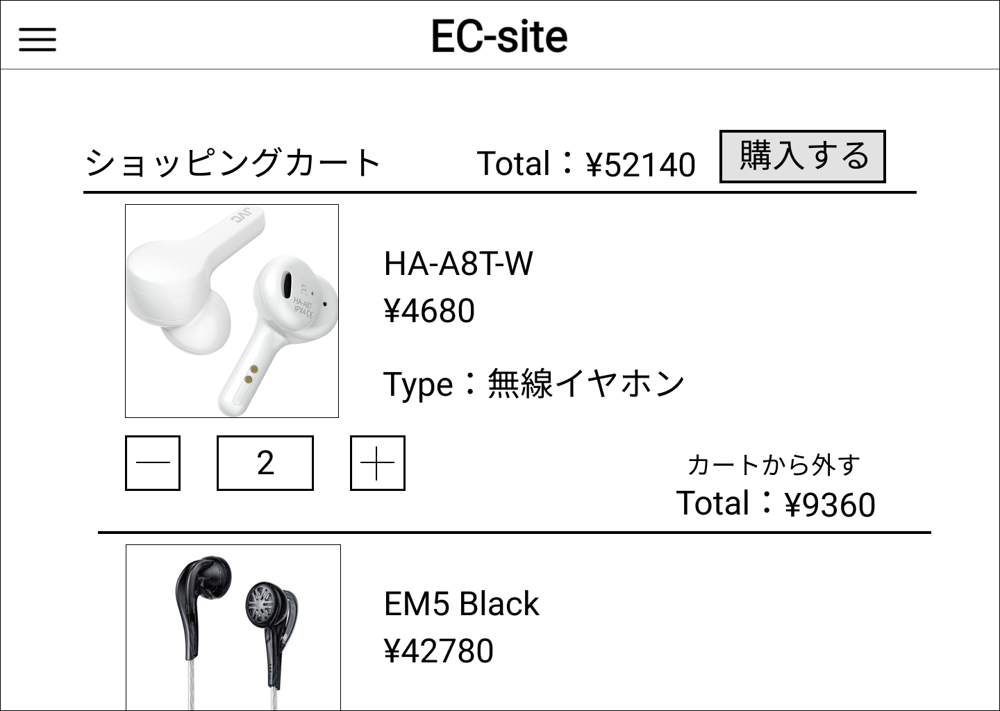

### 画面詳細図
## ショッピングカート
### プロトタイプはリンク先
[プロトタイプ](https://www.figma.com/file/67Ka4HSngBCQciwmHrwcTe/original?node-id=16%3A34)
*****

*****
| ID | 要素 | 内容 | アクション | イベント | 対応DB |
|----|-----|------|-----------|----------|-------|
|1   |バナー|サイト名表示|-|-|-|
|2   |ハンバーガーメニュー|メニュー表示|-|-|
|3   |ショッピングカート|テキスト表示|-|-|-|
|4   |Total|カート内の全商品合計金額|-|-|〇|
|5   |購入する|ボタン|クリック|決済画面へ遷移|〇|
|6   |商品画像|画像リンク|クリック|商品詳細へ遷移|〇|
|7   |商品名|テキストリンク|クリック|商品詳細へ遷移|〇|
|8   |価格|テキストリンク|クリック|商品詳細へ遷移|〇|
|9   |Type|テキストリンク|クリック|商品詳細へ遷移|〇|
|10  |数量|Number|クリック|数値の増減|〇|
|11  |Total|その商品の合計金額|-|-|〇|
|12  |カートから外す|テキストリンク|クリック|カート内から削除|〇|
