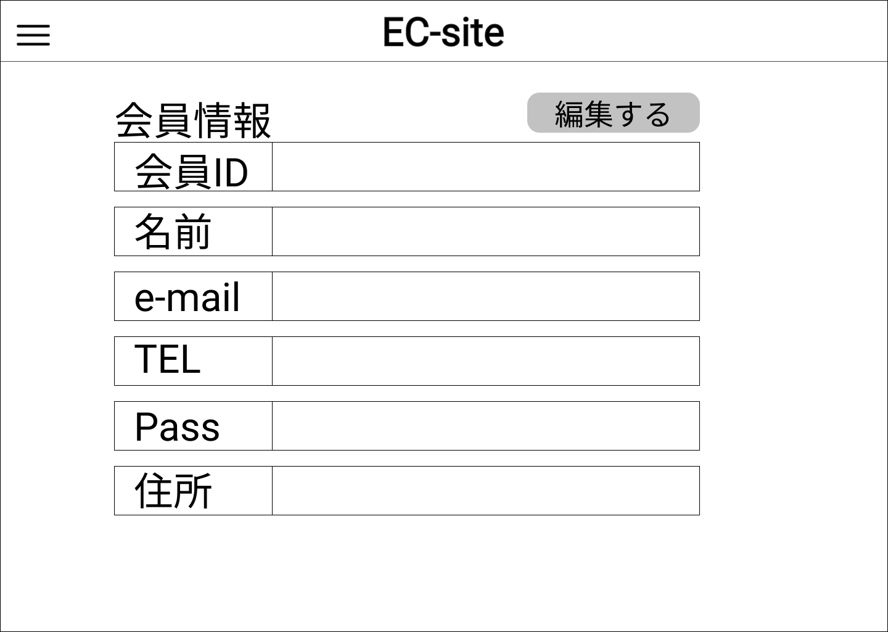

### 画面詳細図
## 会員情報
### プロトタイプはリンク先
[プロトタイプ](https://www.figma.com/file/67Ka4HSngBCQciwmHrwcTe/original?node-id=16%3A34)
*****

*****
| ID | 要素 | 内容 | アクション | イベント | 対応DB |
|----|-----|------|-----------|----------|-------|
|1   |バナー|サイト名表示|-|-|-|
|2   |ハンバーガーメニュー|メニュー表示|クリック|-|-|
|3   |会員情報|テキスト表示|-|-|-|
|4   |編集する|ボタン|クリック|編集画面へ遷移|〇|
|5   |会員ID|テキスト表示|-|-|-|
|6   |会員ID|テキスト表示|-|-|〇|
|7   |ユーザー名|テキスト表示|-|-|-|
|8   |ユーザー名|テキスト表示|-|-|〇|
|9   |メールアドレス|テキスト表示|-|-|-|
|10  |メールアドレス|テキスト表示|-|-|〇|
|11  |電話番号|テキスト表示|-|-|-|
|12  |電話番号|テキスト表示|-|-|〇|
|13  |住所|テキスト表示|-|-|-|
|14  |住所|テキスト表示|-|-|〇|
|15  |パスワード|テキスト表示|-|-|-|
|16  |パスワード|テキスト表示|-|-|〇|
