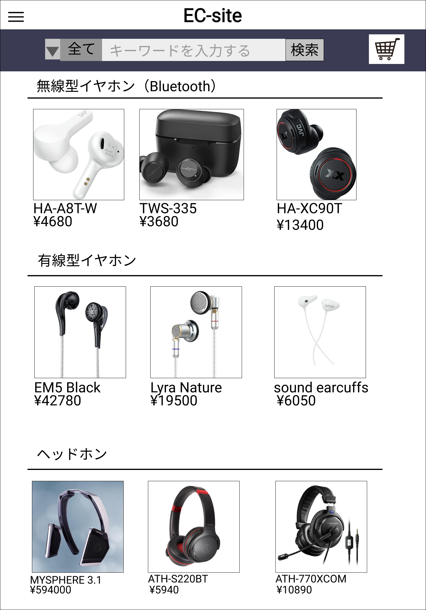

### 画面詳細図
## 商品一覧
### プロトタイプはリンク先
[プロトタイプ](https://www.figma.com/file/67Ka4HSngBCQciwmHrwcTe/original?node-id=16%3A34)
*****

*****
| ID | 要素 | 内容 | アクション | イベント | 対応DB |
|----|-----|------|-----------|----------|-------|
|1   |ヘッダー|サイト名表示|-   |-         |-      |
|2   |ハンバーガーメニュー|メニュー表示|クリック|-|- |
|3   |商品検索バー|入力欄|テキスト入力|-   |-       |
|4   |検索|ボタン|クリック|検索処理実行|〇|
|5   |ショッピングカート|画像ボタン|クリック|ショッピングカートへ遷移|〇|
|6   |カテゴリ|セレクトボックス|クリック|- |-       |
|7   |無線型イヤホン|テキストリンク|クリック|無線型イヤホン一覧へ遷移|〇|
|8   |有線型イヤホン|テキストリンク|クリック|有線型イヤホン一覧へ遷移|〇|
|9   |ヘッドホン|テキストリンク|クリック|ヘッドホン一覧へ遷移|〇|
|10  |商品画像|画像リンク|クリック|商品詳細へ遷移|〇 |
|11  |商品名|テキストリンク|クリック|商品詳細へ遷移|〇|
|12  |価格|テキスト表示|-       |-        |〇      |
