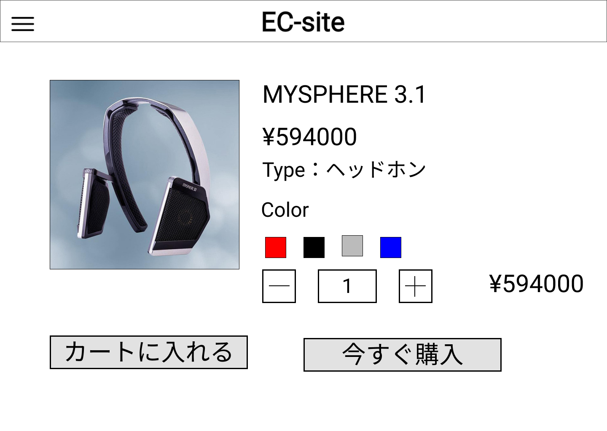

### 画面詳細図
## 商品詳細
### プロトタイプはリンク先
[プロトタイプ](https://www.figma.com/file/67Ka4HSngBCQciwmHrwcTe/original?node-id=16%3A34)
*****

*****
| ID | 要素 | 内容 | アクション | イベント | 対応DB |
|----|-----|------|-----------|----------|-------|
|1|バナー|サイト名表示|-|-|-|
|2|ハンバーガーメニュー|メニュー表示|-|-|-|
|3|商品画像|画像表示|-|-|〇|
|4|商品名|テキスト表示|-|-|〇|
|5|価格|テキスト表示|-|-|〇|
|6|タイプ|テキスト表示|-|-|〇|
|7|カラー|色選択|クリック|画像変移|〇|
|8|数量|Number|クリック|数値の増減|〇|
|9|合計金額|テキスト表示|-|価格×数量|〇|
|10|カートに入れる|ボタン|クリック|ショッピングカートに追加|〇|
|11|今すぐ購入|ボタン|クリック|決済画面へ遷移|〇|
